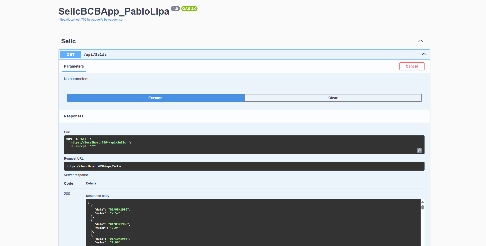
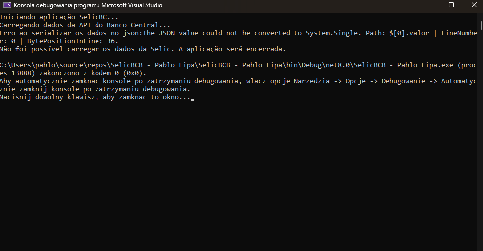
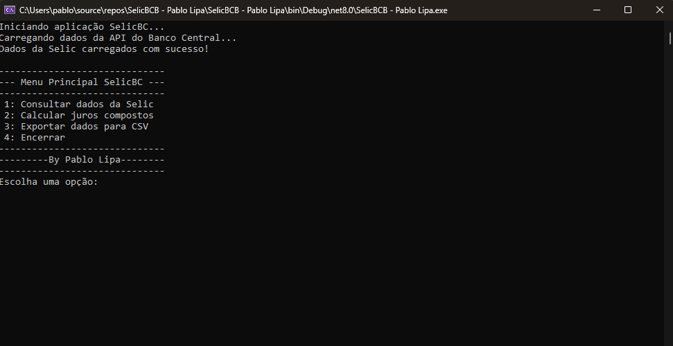

# SelicBCB

Aplicação desenvolvida como parte de um desafio técnico proposto pelo time da Revio Tecnologias. O repositório disponível em SelicBC contém a solução apresentada, com foco em boas práticas de desenvolvimento, organização de código e entrega de valor técnico. Link do desafio: https://github.com/guilhermegriloamorim/SelicBC.git.

# Desafios & Dificuldades
-------------- Desafios ----------------------------
* Lidar com o tempo
* Lidar com os erros de logicas
* Conversão do tipo de dado do atributo de valor.
* Entregar no prazo determinado

-------------- Dificuldades -------------------------
* No começo fuquei pensando em qual template de projeto seria o adequado! pois, começei a desenvolver em ASP.NET para imprecionar. Mas, pensei que seria desnecessario. Pensei que seria mais adequado desenvolver em Windows Form, console o qualquer outro template. Contudo, entrei em contato com a Revio para informar-me se tinham alguma preferenncia por template de projeto. Disseram: "Console".

<picture>
  <source media="(prefers-color-scheme: dark)" srcset="./AspProj.png">
  <source media="(prefers-color-scheme: light)" srcset="./AspProj.png">
  
</picture>  

[Projeto que iniciei em Asp.NET](/AspProj.png)

* Conversão do Tipo de dado do atributo Valor. (foi um erro inesperado que tive no decorrer do projeto. E a solução foi criar uma classe para lidar com a converção do dado para que o programa pudesse entender o seu formato. ***Utilizei a AI nesta função***)
solução: é uma classe que lida com o tratamento do atributo valor e uso como anotação no modelo onde tem Get e Set do atributo.

<h2 align="center">O erro inesperado!</h2> 
<picture>
  <source media="(prefers-color-scheme: dark)" srcset="./ErroTipo.png">
  <source media="(prefers-color-scheme: light)" srcset="./ErroTipo.png">
  
</picture>  

[Erro que quebrei a cabeça para resolver](/ErroTipo.png)

* Integração com SQLite. (infelizmente devido ao tempo e uns contra tempo. Não deu para implementar na aplicação final. Mas, cheguei a criar a integração ao SQLite, basedo em um código pessoal, Mas infelizmente não deu para integrar com o  programa principal.)
* Realizar o calculo dos juros compostos! Pois, confesso que tive que revissar a forma de calcular o juros compostos.

# Check List de funcinalidades
feitas: 
Requisição HTTP para consumo da API pública de dados Selic. (✓)
Exportar para CSV. (✓)
Serialização dos dados JSON em objetos fortemente tipados. (✓)
Exibição de menu interativo com opções para o usuário. (✓)
Validação de entrada de dados e tratamento de exceções. (✓)
Cálculo de juros compostos com base nas taxas Selic. (✓)

Não Feitos e justificativa: 
Exportar para Excel (X) -> Não implementei porque poderia escolher se implentava a exportação para CSV ou ecxel. E o CSV por opinião pessoal acho mais facil e mais ajo que o excel. Além de precisar de uma lib externa para manipulação de arquivo Excel (Se não estou enganado). 

Ordenado por data mais antiga (X) -> Infelizmente acabei esquecendo de implementar essa função.  

(Opcional) Persistência local em banco de dados SQLite. (X) -> infelizmente pelo restante do tempo que tinha não acabou dando tempo.

# Resultado final

<h2 align="center">Aplicação Resultado Final!!!!</h2> 
<picture>
  <source media="(prefers-color-scheme: dark)" srcset="./ProgramaFinal.png">
  <source media="(prefers-color-scheme: light)" srcset="./ProgramaFinal.png">
  
</picture>  

[Programa com resultado final](/ProgramaFinal.png)

* Espero que tenham gostado e que me consedam essa oportunidade pois quero crescer e me desnvolver profissionalmente nesta area junto com a empresa para aingir meus sonhos e objetivos.
